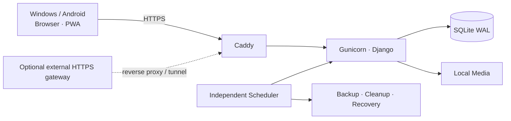

# 📦 校驿 · Campus Delivery Desk

> 面向小型校园代取与配送团队的轻量、自托管运营系统。

[](https://www.python.org/)
[](https://www.djangoproject.com/)
[](https://www.sqlite.org/)
[](https://htmx.org/)
[](https://getbootstrap.com/)
[](https://www.docker.com/)
[](https://caddyserver.com/)
[](LICENSE)

校驿服务于约 3～5 人的校园配送团队：客户通过微信联系，录单员统一录入，配送员在手机端接单、取件、拍照和完成配送，管理员负责人员、价格、结算、经营分析与备份恢复。客户无需注册或登录。

## ✨ 核心能力

- 覆盖快递、校门口外卖、周四 KFC、果蔬零食、跑腿和行李上楼六类业务。
- 普通客户与代理批次两套收件体系，支持临时收件人、归拢和代理凭证。
- 路线抢单、批量接单、实物交接转单、近景/远景照片和图片标注。
- 基于费用项的可审计计价，支持结算冻结、退款、撤销、收益归属和工资计算；工资支持系统默认比例、配送员个人覆盖和周期重叠检查。
- 多维 Dashboard、全局搜索和 Excel 导出；10 万级本机代表查询已完成基准验证。
- 单账号单活跃会话、30 天滚动登录、登录历史、角色权限、幂等提交、Append-only 审计和维护模式。
- 每日自动备份、恢复前保护备份、媒体保留期清理和启动恢复检查。
- 响应式 Web + PWA；Windows 管理端和 Android 配送端共用一套系统。

## 👥 用户角色

| 角色 | 主要工作 |
|---|---|
| 管理员 | 人员、配置、经营分析、工资、备份恢复和维护 |
| 录单员 | 客户/代理管理、录单、异常、费用调整和结算 |
| 配送员 | 接单、取件、配送、转单、归拢和个人统计 |

## 🧱 系统架构



| 层次 | 技术 |
|---|---|
| 后端 | Python 3.12、Django 5.2 LTS、Gunicorn |
| 页面 | Django Templates、HTMX、Alpine.js、Bootstrap 5.3、Chart.js |
| 数据 | SQLite WAL、本地文件、Pillow、openpyxl |
| 运维 | APScheduler 独立进程、Docker Compose、Caddy |

V1 是模块化 Django 单体，不依赖 Redis、Celery、PostgreSQL、微服务或原生客户端。权威业务规格位于 [`docs/spec/`](docs/spec/README.md)。

## 🚀 本地开发（Windows）

### 1. 环境要求

- Windows 10/11
- Python 3.12+
- Git

### 2. 安装

在 PowerShell 中进入项目根目录：

```powershell
python -m venv .venv
.\.venv\Scripts\python.exe -m pip install -r requirements/dev.lock
.\.venv\Scripts\python.exe -m pip install --no-deps -e .
New-Item -ItemType Directory -Force data/db,data/media,data/backups,data/tmp,data/logs
```

`requirements/dev.lock` 固定测试过的开发依赖；`pyproject.toml` 保存项目允许的版本范围。

### 3. 初始化数据库

```powershell
.\.venv\Scripts\python.exe manage.py migrate
.\.venv\Scripts\python.exe manage.py seed_initial_config
.\.venv\Scripts\python.exe manage.py create_app_admin
```

`create_app_admin` 会交互式创建第一个管理员。系统不会预置默认账号或密码。

### 4. 启动

```powershell
.\run-dev.bat
```

浏览器打开 <http://127.0.0.1:8000/>。以后可用 `run-dev.bat --check` 只检查开发环境。

### 5. 可选 Demo 数据

```powershell
.\.venv\Scripts\python.exe manage.py seed_demo
```

Demo seed 只允许在 DEBUG 开发环境运行，具有幂等保护，且不会进入生产初始化流程。不要在 Demo 环境录入真实客户资料。

## 🐳 Docker Compose 部署

生产部署同时支持 Windows 和 Linux，应用容器及业务行为一致；差异只在 Docker 的安装方式和宿主机命令。

### 1. 环境要求

| 平台 | 必备工具 | 说明 |
|---|---|---|
| Windows 10/11 x64 | Docker Desktop、WSL2、Docker Compose v2 | 启动前确认 Docker Desktop 正在运行 |
| Linux x86_64 / arm64 | Docker Engine、Docker Compose plugin v2 | 当前用户需有执行 `docker` 的权限 |

两种平台都建议安装 Git 以便克隆和更新代码。宿主机不需要另外安装 Python、Django、SQLite 或 Caddy。项目默认通过 `18080/18443` 暴露 HTTP/HTTPS，避免 Windows 常见的 `80/443` 占用或系统保留；正式公网部署若希望使用不带端口号的标准 URL，则还需要稳定域名、正确的 DNS 解析，并确认宿主机 `80/443` 可用。

Compose 启动三个职责独立的服务：

- `web`：Gunicorn + Django；
- `scheduler`：备份、媒体清理、租约和临时文件任务；
- `caddy`：静态文件、反向代理和 HTTPS 入口。

### 2. 获取代码并准备配置

Windows PowerShell：

```powershell
git clone https://github.com/tuanliubuxi/campus-delivery-desk.git
Set-Location campus-delivery-desk
Copy-Item .env.example .env
$bytes = New-Object byte[] 48
[Security.Cryptography.RandomNumberGenerator]::Create().GetBytes($bytes)
[Convert]::ToBase64String($bytes)
```

Linux：

```bash
git clone https://github.com/tuanliubuxi/campus-delivery-desk.git
cd campus-delivery-desk
cp .env.example .env
head -c 48 /dev/urandom | base64
```

将生成结果填入 `.env` 的 `DJANGO_SECRET_KEY`，不要提交 `.env`。随后根据网络入口填写：

| 变量 | 本机/局域网默认配置 | Caddy 直连固定域名 | 外部 HTTPS 网关转发到本机 HTTP |
|---|---|---|---|
| `DJANGO_ALLOWED_HOSTS` | `localhost,127.0.0.1` | `delivery.example.com,localhost` | `public.example.com,localhost` |
| `DJANGO_CSRF_TRUSTED_ORIGINS` | `https://localhost:18443` | `https://delivery.example.com` | `https://public.example.com` |
| `APP_BASE_URL` | `https://localhost:18443` | `https://delivery.example.com` | `https://public.example.com` |
| `APP_DOMAIN` | `localhost` | `delivery.example.com` | `:80` |
| `TLS_DEFAULT_SNI` | `localhost` | `delivery.example.com` | `localhost`（HTTPS 在上游终止） |
| `PUBLIC_SCHEME` | `https` | `https` | `https` |
| `HTTP_PORT` / `HTTPS_PORT` | `18080` / `18443` | `80` / `443` | 按网关入口配置 |

直连固定域名由 Caddy 自动申请和续期证书。若 HTTPS 已由云负载均衡、反向代理或内网穿透服务终止，应让 Caddy 监听本机 `80`，并保持 `PUBLIC_SCHEME=https`。不要把只能由外部网关访问的临时域名交给本机 Caddy 申请证书。

### 3. 首次初始化

以下命令在 Windows PowerShell 和 Linux shell 中相同：

```bash
docker compose config --quiet
docker compose build
docker compose run --rm web python manage.py migrate
docker compose run --rm web python manage.py seed_initial_config
docker compose run --rm web python manage.py create_app_admin
docker compose up -d
docker compose ps
```

Windows 可使用 `run-prod.bat` 完成同一流程；`run-prod.bat --check` 只检查 Docker、`.env` 和 Compose 配置。Linux 日常启动使用：

```bash
docker compose up -d
docker compose ps
```

### 4. 网络入口注意事项

- 正式环境必须通过 HTTPS 访问；不要关闭安全 Cookie 或 CSRF 校验来适配纯 HTTP。
- Caddy 在容器内使用标准 `80/443`，宿主机默认映射为 `18080/18443`，因此本机访问地址是 `https://localhost:18443`。公网直连可在 `.env` 中改为 `HTTP_PORT=80`、`HTTPS_PORT=443`；若自定义其他端口，必须同步更新 `APP_BASE_URL` 和 `DJANGO_CSRF_TRUSTED_ORIGINS`。
- 若域名发生变化，同步修改 `DJANGO_ALLOWED_HOSTS`、`DJANGO_CSRF_TRUSTED_ORIGINS` 和 `APP_BASE_URL`，然后运行 `docker compose up -d --force-recreate`。
- 域名变化会形成新的 PWA Origin，旧域名中的安装入口和浏览器本地草稿不会自动迁移。
- 外部反向代理或穿透工具只是网络入口，不是项目依赖；可按部署环境自行选择。

### 5. 局域网手机测试

假设宿主机局域网地址为 `192.168.2.14`，需要同步配置站点地址和无 SNI 客户端的证书回退：

```env
DJANGO_ALLOWED_HOSTS=localhost,127.0.0.1,192.168.2.14
DJANGO_CSRF_TRUSTED_ORIGINS=https://192.168.2.14:18443
APP_BASE_URL=https://192.168.2.14:18443
APP_DOMAIN=192.168.2.14
TLS_DEFAULT_SNI=192.168.2.14
PUBLIC_SCHEME=https
HTTP_PORT=18080
HTTPS_PORT=18443
```

重新创建容器后，在同一局域网访问 `https://192.168.2.14:18443`。Caddy 会为局域网 IP 签发本地证书；手机若未安装该实例的根证书会显示安全警告。使用公网 HTTPS 网关时将 `APP_DOMAIN` 改为 `:80`，公网域名写入 Django 允许主机、CSRF 来源和 `APP_BASE_URL`，`TLS_DEFAULT_SNI` 可保留为 `localhost`。

## 📦 私有备份与离线部署包

根目录的发布脚本会在 Git 忽略的 `tags/<版本名>/` 中生成三类私有产物，每个版本单独成目录。默认版本名中的版本号直接读取 `pyproject.toml` 的 `[project].version`，日期读取构建当天，例如 `tags/campus-delivery-desk-v0.3.3-20261007/`。准备新版本时先按语义化版本规则修改该字段：兼容性修复递增最后一位，新增兼容功能递增中间位，发生不兼容变化才递增第一位。也可把自定义发布名作为构建脚本第二个参数传入，但项目版本仍以 `pyproject.toml` 为准。

| 产物后缀 | 内容 | 用途 |
|---|---|---|
| `-project-private-windows-amd64.zip` / `-project-private-linux-arm64.tar.gz` | 源码、`.git`、`.env`、`data/`、本地文档和当前宿主机 `.venv` | 完整私有恢复；其中 `.venv` 只适用于相同宿主环境 |
| `-offline-runtime-amd64.zip` / `.tar.gz` | Docker tar、启动脚本、Compose、Caddy、`.env` 与 `data/` | 最简迁移包；解压后直接运行离线脚本 |
| `-manifest-amd64.txt` / `-manifest-arm64.txt` | Git commit、平台和 SHA-256 | 核对目标架构与文件完整性 |

构建前应提交所有受 Git 跟踪的修改、停止 Compose 服务，并确认 `.env` 和数据库状态正确。Windows：

```powershell
.\build-release.bat amd64
```

Linux：

```bash
chmod +x build-release.sh run-offline.sh
./build-release.sh amd64
```

`amd64` 可替换为 `arm64`；Docker 镜像必须与目标主机 CPU 架构一致。私有源码包中的 `.venv` 可能包含宿主机路径及平台相关二进制，只用于同环境恢复，不能替代 Docker 离线包。同一 Git commit 构建第二种目标架构时会复用已有源码包，不会再次复制 `.venv`。

`arm64` 运行包面向安装了 Docker Engine 的 ARM64 Linux 主机。普通 Android Termux 不是受支持的 Docker Engine 主机；仅有 ARM64 镜像并不能绕过 Android 内核、权限、cgroup 和容器运行时要求。

在完整项目根目录运行离线脚本时，脚本会按当前 CPU 架构扫描 `tags/*/` 下的运行包，列出版本供选择，并解压到 `deployments/<版本名>-offline-runtime-<架构>/`。部署目录中的 Compose 仍使用根目录的 `.env` 和 `data/`，因此切换版本不会创建一套空数据库；`deployments/` 只保存该版本的启动文件和内嵌镜像包。

```powershell
.\run-offline.bat
```

```bash
chmod +x run-offline.sh
./run-offline.sh
```

如果只把 `offline-runtime` 包传到另一台机器，解压后进入其目录运行同名脚本即可。此时没有根目录启动器注入共享路径，脚本会使用运行包自己的 `.env` 和 `data/`：

```powershell
.\run-offline.bat
```

```bash
chmod +x run-offline.sh
./run-offline.sh
```

需要自动化部署时，也可以显式传入解压目录内的 Docker tar 路径：

```powershell
.\run-offline.bat ".\campus-delivery-desk-v0.3.0-20261005-docker-linux-amd64.tar"
```

```bash
chmod +x run-offline.sh
./run-offline.sh ./campus-delivery-desk-v0.3.0-20261005-docker-linux-amd64.tar
```

脚本会执行 `docker load`、迁移、幂等初始化、必要时创建首个管理员，然后以 `--no-build --pull never` 启动服务。目标机仍须预先安装 Docker；固定域名首次签发公开 HTTPS 证书也需要网络。私有项目包包含密钥和业务数据，当前格式未加密，只能通过可信介质传输并妥善保管，禁止上传到公开仓库或公共网盘。

根目录自动部署模式下不要手工移动或复制业务数据库；它始终使用根目录 `data/`。若需要强制重新解压同名运行包，可以在服务停止后删除对应的 `deployments/<版本与架构>/`，再运行根目录脚本，业务数据不会随部署目录删除。独立运行包模式下，后续升级不要把新包覆盖到已有目录，因为包内初始 `data/` 可能覆盖生产数据；应先创建备份并保留原 `data/` 和 `.env`。镜像成功导入后可以删除目录内的 Docker tar 来节省空间，但保留它可用于断网重装。

三类压缩包的运行边界如下：

| 文件 | 普通 AMD64 Windows + Docker Desktop | 说明 |
|---|---|---|
| `project-private-windows-amd64.zip` | 可恢复源码；不能直接离线启动 | 包含 Windows `.venv`，但虚拟环境仍依赖相同 CPU、Python 版本及兼容安装路径；Docker 构建还可能需要网络 |
| `offline-runtime-amd64.zip` | 支持，推荐 | 包内已有 Linux AMD64 应用与 Caddy 镜像，可完全离线导入 |
| `offline-runtime-arm64.zip` | 不作为普通 AMD64 Windows 的运行包 | 面向 Docker ARM64 Linux；即使启用模拟也不作为生产部署方案 |

## 🗂️ 数据与运维

所有运行数据均位于 `data/`，不会写入 Docker 镜像：

```text
data/
├─ db/        # SQLite 数据库
├─ media/     # 配送照片和生成凭证
├─ backups/   # 应用内备份
├─ tmp/       # 原子上传和临时文件
└─ logs/      # 恢复检查使用的预留目录；当前应用日志不写入此处
```

- `/health/live`：进程存活检查。
- `/health/ready`：数据库和数据目录可用检查。
- Web 和 scheduler 的运行/错误日志输出到容器标准输出，使用 `docker compose logs --tail 200 web scheduler` 查看；Web“系统日志”是保存在数据库中的业务审计，两者用途不同。`data/logs/` 为空属于当前正常行为。
- scheduler 每日 03:00 自动备份，并按配置清理过期媒体和临时文件。
- 管理员可在 Web 中创建、下载、恢复和删除备份；恢复前自动创建 PRE_RESTORE 保护点。
- 更新流程：进入维护模式 → 创建保护备份 → build/pull → migrate → restart → Recovery Check → 核对后退出维护。

数据库、媒体、备份、`.env`、日志和真实客户资料都不会被 Git 跟踪。详细恢复规则见 [`docs/spec/08_OPERATIONS_BACKUP_RECOVERY.md`](docs/spec/08_OPERATIONS_BACKUP_RECOVERY.md)。

## 🧪 质量检查

```powershell
.\.venv\Scripts\python.exe -m pytest
.\.venv\Scripts\python.exe -m ruff check .
.\.venv\Scripts\python.exe manage.py check
.\.venv\Scripts\python.exe manage.py makemigrations --check --dry-run
git diff --check
```

自动回归覆盖领域服务、权限、页面、弱网与发布契约。10 万级性能基准、依赖锁和恢复演练见 [`docs/V1_HARDENING_REPORT.md`](docs/V1_HARDENING_REPORT.md)；真实 Android/Windows 验收见 [`docs/MANUAL_ACCEPTANCE.md`](docs/MANUAL_ACCEPTANCE.md)。

## 📁 项目结构

```text
apps/           Django 领域模块、services、selectors 与测试
config/         URL、ASGI/WSGI、开发/生产设置
templates/      响应式页面与 HTMX partials
static/         CSS、JavaScript、PWA 与前端依赖
requirements/   生产/开发精确依赖锁
docs/spec/      V1 权威需求规格
data/           本地运行数据（Git 忽略）
```

## 📄 License

本项目采用 [MIT License](LICENSE)。
